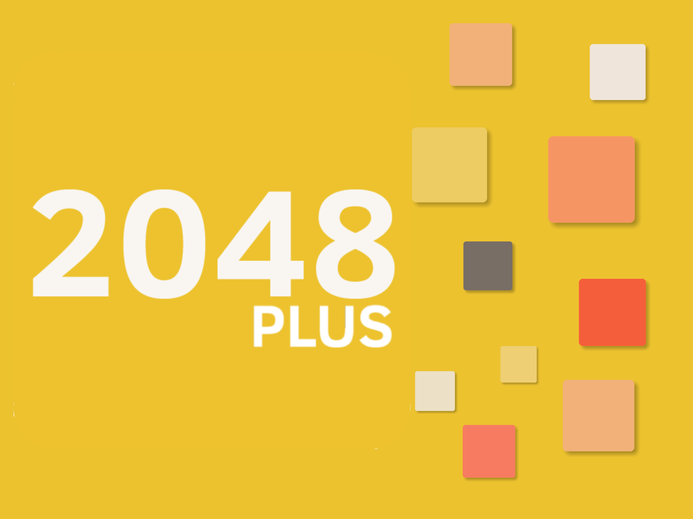

<p align="center">
  
</p>

A feature-packed implementation of the classic puzzle game 2048 for muOS and PortMaster, built using the LÖVE framework.

This project is inspired by and references the popular open-source [2048 Android](https://github.com/tpcstld/2048) game by tpcstld, which itself is based on the original web game by Gabriele Cirulli. While taking visual and design references from the Android version, this codebase was written from the ground up in Lua for the LÖVE engine. In addition to the classic gameplay, I have introduced numerous new features, including multiple game modes, store, an achievement system, and a wide variety of themes to enhance the overall experience.

## Features

- **Game Modes**: Classic, Plus Mode with Bomb, Swap, and Undo powerups, and 4 Arcade Modes — Time Attack, 5x5 Huge, No Mercy, and Goose.
- **Store & Customization**: In-game Store with Coins currency, Cat & Dog pet companions, board skins, unlockable themes, and more.
- **Achievements & Stats**: Many unlockable achievements and comprehensive stats tracking.
- **Quality of Life**: Auto-save & resume after every move, interactive pause menu with active perks HUD, and instant theme switching.

*Note: Perhaps a well-known secret sequence of buttons might reveal something special...?*

## Installation on muOS

1. Download the latest `.muxapp` file from the [Releases](https://github.com/saitamasahil/2048plus/releases) page or build your own following the [Building from Source](#building-from-source) instructions.
2. Move the downloaded file to the `/mnt/mmc/MUOS/ARCHIVE` folder on your SD card.
3. Open Archive Manager on your device and select the file to install.
4. After installation, you'll find an entry called "2048 Plus" in the Applications section.

## Installation on PortMaster

### Method 1: Direct Install via PortMaster
1. Launch the PortMaster application on your handheld.
2. Go to All Ports or Ready to Run and search for `2048 Plus`.
3. Select Install. The game will automatically download and install into your Ports menu.

### Method 2: Offline Autoinstall
1. Download the game's `.zip` release package on your PC from [PortMaster](https://portmaster.games/detail.html?name=2048plus) or build your own following the [Building from Source](#building-from-source) instructions.
2. Place the downloaded `.zip` file directly into the `autoinstall` folder on your SD card for your OS:
   - **muOS:** `/mnt/mmc/MUOS/PortMaster/autoinstall/`
   - **ArkOS:** `/roms/tools/PortMaster/autoinstall/`
   - **AmberELEC / ROCKNIX:** `/roms/ports/PortMaster/autoinstall/`
   - **Knulli:** `/userdata/system/.local/share/PortMaster/autoinstall/`
3. Reinsert the SD card into your device and launch the PortMaster app once.
4. PortMaster will automatically detect the `.zip` file and complete the installation.

## Controls

| Button | Action |
|--|--| 
| **D-Pad / Left Stick** | Swipe tiles / Navigate Menus / Seek Track (◄ -10s / ► +10s in Jukebox) |
| **A** | Confirm / Select Item / Confirm Powerup Target |
| **B** | Undo Move (Classic & Plus Mode) / Cancel Target / Go Back |
| **X** | Quit to Menu (Pause / Game Over / Victory) |
| **Y** | Cycle Unlocked Themes |
| **L1** | Activate Swap Powerup (Plus Mode) / Activate Shield (Game Over) / Open Jukebox |
| **R1** | Activate Bomb Powerup (Plus Mode) / Activate Shield (Game Over) / Open Store |
| **Select** | Show Coin Balance During Gameplay |
| **Start** | Open Pause Menu / Resume Gameplay |
| **Menu + Start** | Exit the game safely (force quit) |

*Note: Your progress is automatically saved after every move. You can safely close the game and pick up exactly where you left off.*

## Building from Source

To build the packages yourself, make sure you are in a Linux or macOS environment with `bash` and `zip` installed.

1. Clone this repository:
   ```bash
   git clone https://github.com/saitamasahil/2048plus.git
   cd 2048plus
   ```

2. Make the build script executable:
   ```bash
   chmod +x build.sh
   ```

3. Run the build script:
   ```bash
   ./build.sh
   ```

4. Select your target from the interactive menu (or press **Enter** to build both):
   - **`1` (muOS)**: Generates the muOS package in `build/`
   - **`2` (PortMaster)**: Generates the PortMaster package (`2048plus.zip`) in `build/`
   - **`3` (Both / Default)**: Generates both packages simultaneously

*Note: You can also build non-interactively via CLI arguments: `./build.sh muos`, `./build.sh portmaster`, or `./build.sh both`.*

## Credits & Acknowledgements

- Original Concept By: [Gabriele Cirulli](https://github.com/gabrielecirulli/2048)
- Android Port Reference: [tpcstld - 2048](https://github.com/tpcstld/2048)
- Built using the [LÖVE Framework](https://love2d.org/)
- Adorable Animal Sprites by: [Elthen](https://elthen.itch.io/) and [Pixelcave](https://pixelcave.itch.io/)
- Animated Button Prompts by: [greenpixels_](https://greenpixels.itch.io/)
- Icons provided by [Flaticon](https://www.flaticon.com/)
- Special Thanks: [Egggdoggo](https://github.com/Egggdoggo) & **d98jay** for early feedback, playtesting & incredible support!
- Background Music tracks provided via [Chosic](https://www.chosic.com/) by authors: AudioCoffee, Ghostrifter Official, Purrple Cat, Roa, Sakura Girl, and Tokyo Music Walker.

---

Made with 💙 by **saitamasahil**
